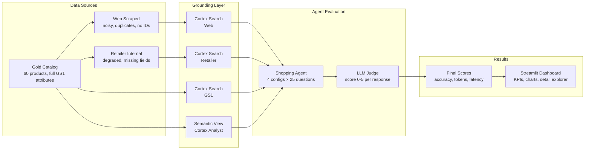
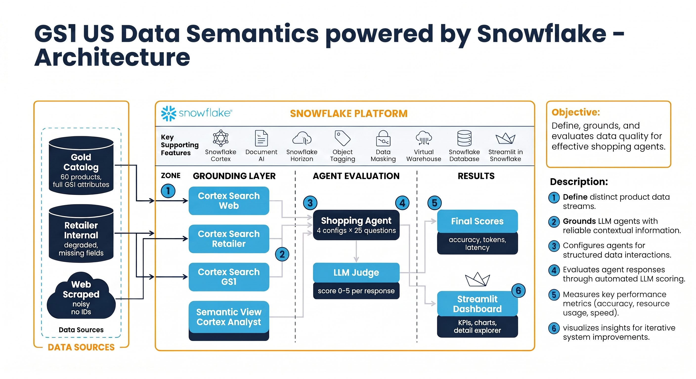
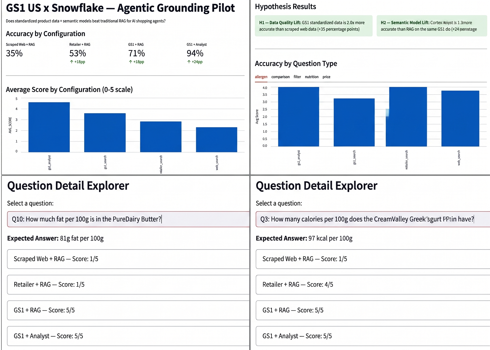

# GS1 US + Snowflake Pilot

## What This Is

A joint pilot proving that AI shopping agents give better, faster, accurate answers when grounded on GS1 US standardized product data — and that Snowflake's semantic models outperform traditional retrieval.

---

## Pilot Architecture

---

## The Two Claims to Prove

1. **Data quality wins:** GS1 standardized product data produces more accurate, complete answers than retailer-internal or scraped web data.
2. **Semantic models win:** Snowflake Cortex Analyst (semantic model) outperforms traditional search/retrieval on the same data — lowering tokens, latency, and cost.

---

## Build Details

| # | Component | Description |
|---|---|---|
| 1 | **Gold product catalog** | ~50-100 synthetic retail products with full GS1 attributes (GTIN, brand, category, price, nutrition, allergens) |
| 2 | **Retailer version** | Same products, degraded: missing ~30% of attributes, no GTIN, flat category, free-text allergens, some stale prices |
| 3 | **Scraped version** | Same products, noisy: marketing copy, duplicates, wrong prices, inconsistent formatting, no identifier |
| 4 | **Cortex Search** | Search service over each data version (retrieval baseline) |
| 5 | **Semantic View** | Semantic model over the GS1 standardized data (Cortex Analyst) |
| 6 | **Cortex Agent** | One shopping agent, fixed config — only the grounding tool changes per run |
| 7 | **Question set** | 20-30 shopping questions with known correct answers |
| 8 | **Run & measure** | Run agent across 4 configurations, capture accuracy + tokens + latency + cost |
| 9 | **Results table** | Comparison showing the lift from better data and better technique |

---

## The 4 Configurations

| Config | Data Source | Technique | What It Proves |
|---|---|---|---|
| 1 | Scraped web | Cortex Search | Baseline (worst case) |
| 2 | Retailer internal | Cortex Search | Mid-quality data |
| 3 | GS1 standardized | Cortex Search | **H1: data quality lift** (compare to Config 1) |
| 4 | GS1 standardized | Cortex Analyst | **H2: semantic model lift** (compare to Config 3) |

**Key comparisons:**
- Config 3 vs 1 = accuracy gain from standardized data
- Config 4 vs 3 = accuracy gain from semantic model
- Config 4 vs 1 = total improvement (the headline number)

---

## What to Measure

| Metric | Description |
|---|---|
| **Accuracy** | Does the answer match the known correct answer? (0-1) |
| **Completeness** | Does it include all requested attributes? (0-1) |
| **Token use** | Input + output tokens per response |
| **Latency** | Response time in milliseconds |
| **Cost** | Snowflake credits consumed |

---

## Product Data: What Each Version Looks Like

**GS1 Standardized (gold):**
- GTIN (14-digit, valid check digit)
- Brand, product name, clean description
- Category hierarchy (e.g., Food > Dairy > Yoghurt)
- Price, currency, availability
- Net content + unit of measure
- Nutrition per 100g (energy, fat, carbs, protein, sugar, fibre, salt)
- Allergens as structured booleans (gluten, dairy, nuts, soy, eggs)
- Country of origin

**Retailer Internal (degraded):**
- Retailer SKU instead of GTIN
- Shorter/inconsistent product names
- Flat category (single level, no hierarchy)
- Price present but sometimes stale
- No nutrition data
- Allergens as free text (or missing)
- No country of origin, no packaging details

**Scraped Web (noisy):**
- No identifier at all
- Marketing copy instead of structured description
- Duplicates (same product from different pages)
- Price sometimes wrong or missing
- Inconsistent formatting ("500g" vs "500 g" vs "0.5kg")
- Brand name variants ("NovaBrand" / "Nova Brand")
- Allergens missing for many products
- Noise: star ratings, review counts, promo text

---

## Question Categories (20-30 total)

| Category | Example |
|---|---|
| **Identity** | "What is the GTIN for NovaBrand Oat Flakes 500g?" |
| **Price** | "How much does the Orange Juice cost?" |
| **Allergen** | "Which products are gluten-free?" |
| **Nutrition** | "Which product has the most protein per 100g?" |
| **Comparison** | "What is the cheapest dairy-free beverage?" |
| **Multi-attribute** | "Find a vegan snack under 200 calories" |

Each question has a `gold_answer` derived from the gold catalog.

---

## Roles

| Party | Responsibility |
|---|---|
| **GS1 US** | Curate product data, validate results, co-author findings |
| **Snowflake** | Build the test environment, run the agent, measure results |
| **Retailer partner** | Permission to share byline (optional for synthetic-data version) |

GS1 commits curation/validation time only. No engineering.

---

## Results

### Measurement Charts - Streamlit Dashboard

### Results and Findings

| Config | Data Source | Technique | Accuracy |
|---|---|---|---|
| 1 | Scraped Web | Cortex Search (RAG) | 35% |
| 2 | Retailer Internal | Cortex Search (RAG) | 53% |
| 3 | GS1 Standardized | Cortex Search (RAG) | 71% |
| 4 | GS1 Standardized | Cortex Analyst (Semantic) | 94% |

**Key findings:**
- GS1 standardized data is **2x more accurate** than scraped web data (H1 confirmed)
- Cortex Analyst is **1.3x more accurate** than RAG on the same GS1 data (H2 confirmed)
- Combined lift: GS1 + Semantic model = **2.7x improvement** over web baseline

Headline: "GS1 standardized data + Snowflake semantic models improve AI shopping agent accuracy from 35% to 94%"

---

## Setup

See [setup.md](setup.md) for step-by-step instructions to deploy the full environment.
